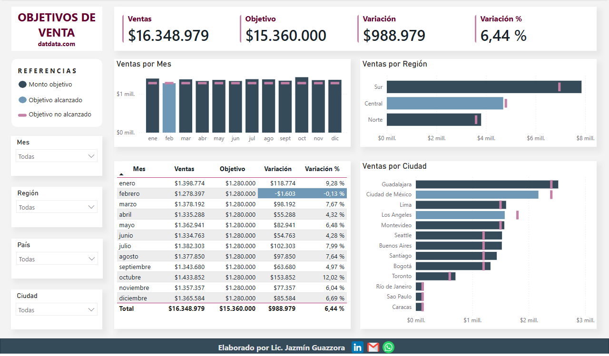

# 📊 Dashboard: Control de Objetivos de Venta

 

## 🎯 Objetivo
Visualizar el cumplimiento de metas comerciales por región y ciudad, facilitando la detección de desviaciones y la toma de decisiones.

## 🛠️ Ficha Técnica
* **Extracción y Transformación (Power Query):** Limpieza, tipado y normalización de datos de ventas y presupuestos.
* **Modelo de Datos:** Implementación de un modelo en estrella (Star Schema).
* **Tabla Calendario:** Creación de dimensión temporal propia para habilitar funciones de **Time Intelligence**.
* **DAX:** Medidas de ventas, objetivos, variaciones % y formato condicional dinámico.
* **Diseño UX/UI:** Layout basado en tarjetas, uso de sombras suaves para profundidad y jerarquía de colores (Azul corporativo).

## 🚀 Cómo visualizar este proyecto
* **Visualización rápida:** Abrir el archivo `analisis_objetivos_ventas_jg.pdf` para ver el diseño y layout final.
* **Exploración técnica:** Descargar el archivo `analisis_objetivos_ventas.pbix` para auditar el modelo y las medidas DAX. Se recomienda navegar las interacciones y filtros para validar la consistencia de los KPIs en los distintos niveles de detalle.

## ✉️ Contacto
[LinkedIn](https://www.linkedin.com/in/jazmin-guazzora/) | [Gmail](mailto:jazminguazzora@gmail.com) | [WhatsApp](https://wa.me/5491169718295)
